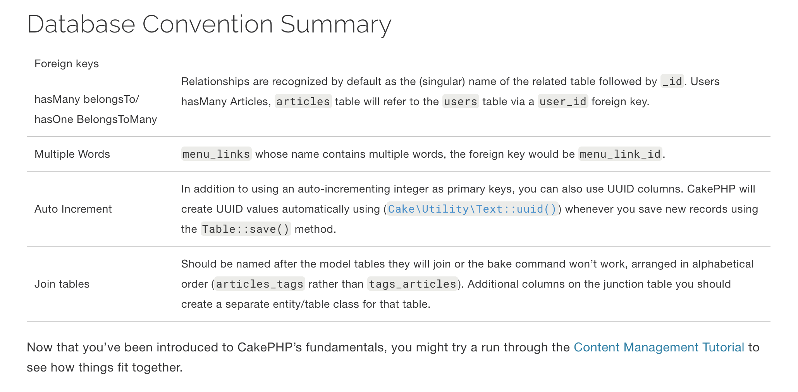
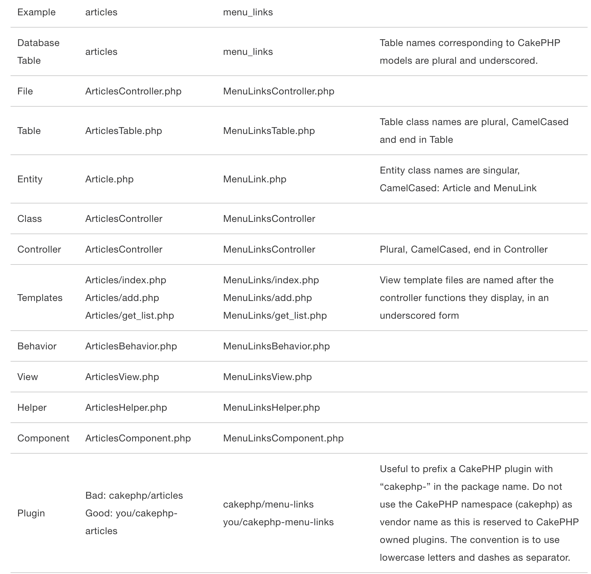

# cakePHPInventory

## References:

### Installation: 

* Install composer: 

* **Install cakephp 5 run** : php composer.phar create-project --prefer-dist cakephp/app:5 . 
    - Note. (.) at the end will download the files in the current folder same as the composer files. 

* https://book.cakephp.org/5/en/quickstart.html

### Cake php folder structure:

* https://book.cakephp.org/5/en/intro/cakephp-folder-structure.html

### Standard to follow when coding:

* File and Class Name Conventions
* Database Conventions



* Model Conventions



* [Reference](https://book.cakephp.org/5/en/intro/conventions.html)

### Folder structure and writing codes:

1. Install the composer in the directory folder 
2. Install cake php inside the direcotry, be mind of the version you are required to work with. Here i used cake 5.
3. Set up the database, I created mine in PHPMyAdmin using MAMP
3. Configer the database 
4. Create the migration file in the config->Migration folder. This can be done in terminal by running the commmand
    -  bin/cake bake migration Initial
    -  bin/cake migrations migrate

5. Use seed to populate the database. Need the basic linux command create the file and then populate the database
    - bin/cake bake seed SeedName
    - bin/cake migrations seed

## Get Database ready in "Model and entity" object

* This can be done manually or via terminal command shell by running Cake php command lines. 
* Run: ```bin/cake bake model Products ```
    - Note: replace word 'Products' with what ever table/entity object your are trying to create 

## Once database is ready, next start working on the controller: 

* This is where object and its properties are created. In this project, object called "ProductsController" was created which had methods index, add, edit, delete, and view. 
* Object created in the controller interacts with both the model (database) and view/tempalte, meaning back and front end of an applicaitons. 

* [Reference](https://book.cakephp.org/5/en/tutorials-and-examples/cms/articles-controller.html)

## We talked about view and templates. Views and templates are your html and css but Cake PHP its has its own standard of HTML called:

* ### HTML Helper: 
* This provides methods which creates the form and some html systaxes. 

* [Refernce](https://book.cakephp.org/5/en/views/helpers/html.html)

#### Git example: 

* https://github.com/HarkiratGhotra/cake/blob/e99dae73cc5f0c127a24f179b7cf8bb6656fab2e/src/Controller/ArticlesController.php

## How to Run the CakePHP Application in cms

1. Start the CakePHP Development Server: **bin/cake server** 
2. Access the Application: Open your browser and go to: **http://localhost:8765** 
3. Stop the server: control+c

## Make sure that the database is running at the same 

* I have used MAMP to run PHPMyAdmin to work with database side of things


## File structure of cake php


### Here is a demo of the application

# Demo

[Click here to view the demo video](/git_img/cakephpDemo.webm)

## Other references: 

### CakePHP coding convention guide to follow:

 - [https://book.cakephp.org/5/en/intro/conventions.html](https://book.cakephp.org/5/en/intro/conventions.html)
